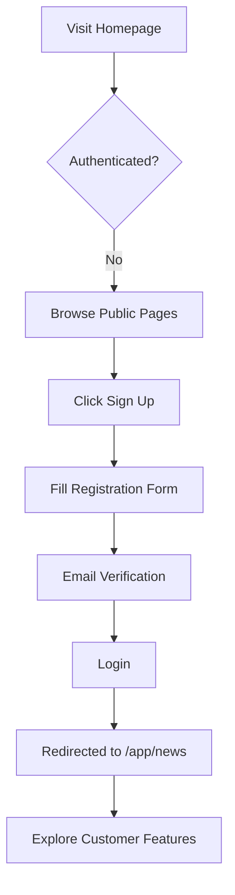
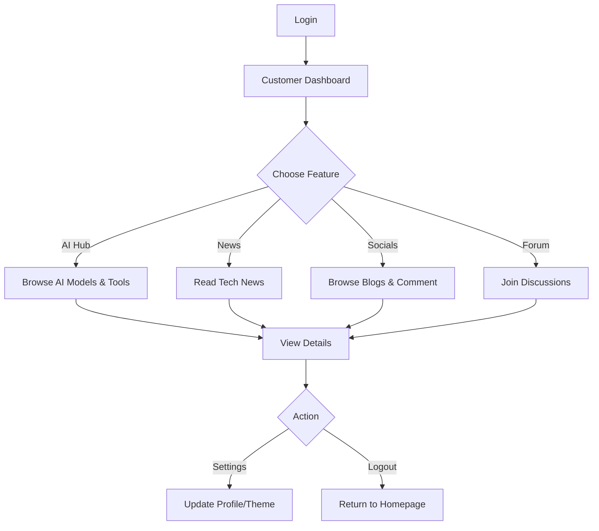
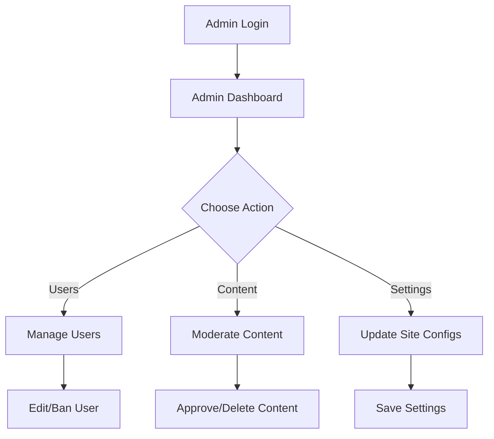

# OneNews - Implementation Plan

## Project Overview

**OneNews** là một news aggregation platform cung cấp tin tức real-time từ các nguồn uy tín, là một phần của **OneApp Ecosystem**. Dự án được thiết kế với khả năng mở rộng từ personal use sang SaaS model cho commercial customers.

### Vision
- **Short-term**: Personal news hub với AI insights và community features
- **Long-term**: Scalable SaaS platform cho paying customers

### Target Audience
- **Primary**: Personal use
- **Future**: Commercial customers (subscription-based)

---

## Tech Stack & Architecture

### Core Technologies
- **Frontend Framework**: React 18+ với Vite
- **Styling**: Tailwind CSS
- **Backend**: Supabase (PostgreSQL + Auth + Storage + Real-time)
- **Routing**: React Router v6
- **State Management**: React Context API / Zustand (for complex state)
- **Form Handling**: React Hook Form
- **HTTP Client**: Axios / Fetch API

### Project Structure (Lovable Compatible)
```
OneNews/
├── src/
│   ├── components/          # Reusable components
│   │   ├── common/          # Button, Input, Card, etc.
│   │   ├── layout/          # Sidebar, Headerbar, Footer
│   │   └── features/        # Feature-specific components
│   ├── pages/              # Page components
│   │   ├── public/         # Public website pages
│   │   ├── customer/       # Customer webapp pages
│   │   └── admin/          # Admin panel pages
│   ├── hooks/              # Custom React hooks
│   ├── contexts/           # React contexts
│   ├── services/           # API services (Supabase)
│   ├── utils/              # Utility functions
│   ├── constants/          # Constants and configs
│   ├── types/              # TypeScript types
│   ├── styles/             # Global styles
│   └── App.jsx             # Main app component
├── public/                 # Static assets
└── supabase/              # Supabase migrations & functions
```

---

## User Types & Role-Based Access

### 1. **Guest User** (Unauthenticated)
- **Access**: Public website only
- **Features**: Browse landing page, about, features showcase

### 2. **Customer User** (Authenticated)
- **Access**: Webapp customer features
- **Features**: AI Hub, News, Socials, Forum, Profile, Settings

### 3. **Admin User** (Authenticated + Admin Role)
- **Access**: Admin panel
- **Features**: User management, content management, site settings

### 4. **OneApp User** (SSO)
- **Access**: Admin OR Customer (user chooses)
- **Authentication**: OneApp SSO integration

---

## Database Schema (Supabase)

### Core Tables

#### `users` (extends Supabase auth.users)
```sql
CREATE TABLE profiles (
  id UUID REFERENCES auth.users PRIMARY KEY,
  email TEXT UNIQUE NOT NULL,
  username TEXT UNIQUE,
  full_name TEXT,
  avatar_url TEXT,
  role TEXT DEFAULT 'customer', -- 'customer', 'admin', 'oneapp'
  is_active BOOLEAN DEFAULT true,
  created_at TIMESTAMP DEFAULT NOW(),
  updated_at TIMESTAMP DEFAULT NOW()
);
```

#### `news_articles`
```sql
CREATE TABLE news_articles (
  id UUID PRIMARY KEY DEFAULT uuid_generate_v4(),
  title TEXT NOT NULL,
  slug TEXT UNIQUE NOT NULL,
  content TEXT,
  excerpt TEXT,
  image_url TEXT,
  category TEXT, -- 'crypto', 'ai', 'tech', 'general'
  source TEXT,
  author_id UUID REFERENCES profiles(id),
  published_at TIMESTAMP DEFAULT NOW(),
  views INTEGER DEFAULT 0,
  created_at TIMESTAMP DEFAULT NOW(),
  updated_at TIMESTAMP DEFAULT NOW()
);
```

#### `blog_posts`
```sql
CREATE TABLE blog_posts (
  id UUID PRIMARY KEY DEFAULT uuid_generate_v4(),
  title TEXT NOT NULL,
  slug TEXT UNIQUE NOT NULL,
  content TEXT,
  author_id UUID REFERENCES profiles(id),
  published BOOLEAN DEFAULT false,
  published_at TIMESTAMP,
  created_at TIMESTAMP DEFAULT NOW(),
  updated_at TIMESTAMP DEFAULT NOW()
);
```

#### `comments`
```sql
CREATE TABLE comments (
  id UUID PRIMARY KEY DEFAULT uuid_generate_v4(),
  content TEXT NOT NULL,
  user_id UUID REFERENCES profiles(id),
  post_id UUID REFERENCES blog_posts(id),
  parent_id UUID REFERENCES comments(id), -- for nested comments
  created_at TIMESTAMP DEFAULT NOW(),
  updated_at TIMESTAMP DEFAULT NOW()
);
```

#### `forum_topics`
```sql
CREATE TABLE forum_topics (
  id UUID PRIMARY KEY DEFAULT uuid_generate_v4(),
  title TEXT NOT NULL,
  slug TEXT UNIQUE NOT NULL,
  description TEXT,
  category TEXT,
  author_id UUID REFERENCES profiles(id),
  is_pinned BOOLEAN DEFAULT false,
  is_locked BOOLEAN DEFAULT false,
  created_at TIMESTAMP DEFAULT NOW(),
  updated_at TIMESTAMP DEFAULT NOW()
);
```

#### `forum_posts`
```sql
CREATE TABLE forum_posts (
  id UUID PRIMARY KEY DEFAULT uuid_generate_v4(),
  content TEXT NOT NULL,
  topic_id UUID REFERENCES forum_topics(id),
  user_id UUID REFERENCES profiles(id),
  created_at TIMESTAMP DEFAULT NOW(),
  updated_at TIMESTAMP DEFAULT NOW()
);
```

#### `ai_models`
```sql
CREATE TABLE ai_models (
  id UUID PRIMARY KEY DEFAULT uuid_generate_v4(),
  name TEXT NOT NULL,
  provider TEXT, -- 'OpenAI', 'Google', 'Anthropic'
  category TEXT, -- 'LLM', 'Image', 'Audio', 'Code'
  pricing JSONB, -- {input_price: 0.01, output_price: 0.02}
  benchmarks JSONB, -- {mmlu: 85.2, humaneval: 78.5}
  description TEXT,
  release_date DATE,
  created_at TIMESTAMP DEFAULT NOW(),
  updated_at TIMESTAMP DEFAULT NOW()
);
```

#### `ai_tools`
```sql
CREATE TABLE ai_tools (
  id UUID PRIMARY KEY DEFAULT uuid_generate_v4(),
  name TEXT NOT NULL,
  category TEXT, -- 'Agent', 'Coding', 'Design'
  url TEXT,
  description TEXT,
  pricing_model TEXT, -- 'free', 'freemium', 'paid'
  rating DECIMAL(2,1),
  created_at TIMESTAMP DEFAULT NOW(),
  updated_at TIMESTAMP DEFAULT NOW()
);
```

### Row Level Security (RLS) Policies

> [!IMPORTANT]
> Tất cả tables phải enable RLS để bảo mật dữ liệu. Chỉ admin mới có toàn quyền CRUD, customer chỉ read và create owned content.

---

## Component Architecture

### Layout Components

#### `Sidebar.jsx`
```jsx
// Collapsible sidebar với nav items
// Props: isCollapsed, onToggle, userRole
// Features: Icons, active state, role-based menu items
```

#### `Headerbar.jsx`
```jsx
// Top navigation bar
// Props: pageTitle, user
// Features: Profile dropdown (logout, settings), notifications icon
```

#### `MainLayout.jsx`
```jsx
// Wrapper cho Sidebar + Headerbar + Main content
// Manages layout state (sidebar collapsed/expanded)
```

### Common Components
- `Button.jsx` - Customizable button với variants (primary, secondary, ghost)
- `Input.jsx` - Form input với validation states
- `Card.jsx` - Container component
- `Modal.jsx` - Reusable modal dialog
- `Dropdown.jsx` - Dropdown menu
- `Avatar.jsx` - User avatar với fallback
- `Badge.jsx` - Status badges
- `Spinner.jsx` - Loading indicator

---

## Feature Breakdown & MVP Phases

### **Phase 1: Foundation** (Week 1)
> Setup project infrastructure

**Deliverables**:
- ✅ Vite + React project initialized
- ✅ Tailwind CSS configured
- ✅ Supabase project created
- ✅ Environment variables setup
- ✅ Routing structure
- ✅ Base folder structure

**Tasks**:
1. Run `npm create vite@latest . -- --template react`
2. Install dependencies: `tailwindcss`, `react-router-dom`, `@supabase/supabase-js`
3. Configure `tailwind.config.js` with custom theme
4. Create `.env.local` with Supabase credentials
5. Setup routes in `App.jsx`

---

### **Phase 2: Public Website** (Week 1-2)
> Priority MVP: Public-facing pages

**Deliverables**:
- ✅ Landing page với hero section
- ✅ Features showcase
- ✅ About page
- ✅ Responsive navigation
- ✅ Footer

**Pages**:
1. **Home (`/`)** - Hero, feature highlights, CTA
2. **Features (`/features`)** - AI Hub, News, Socials, Forum previews
3. **About (`/about`)** - Mission, vision, team

**Components to Build**:
- `Navigation.jsx` - Public nav with login/signup buttons
- `Hero.jsx` - Landing page hero section
- `FeatureCard.jsx` - Feature showcase cards
- `Footer.jsx` - Site footer

---

### **Phase 3: Authentication** (Week 2)
> User authentication & role management

**Deliverables**:
- ✅ Supabase Auth setup
- ✅ Login/Signup pages
- ✅ Protected routes
- ✅ Role-based access control

**Pages**:
1. **Login (`/login`)** - Email/password + OneApp SSO
2. **Signup (`/signup`)** - Registration form
3. **Password Recovery (`/reset-password`)** - Password reset flow

**Services**:
```javascript
// src/services/authService.js
export const signUp = async (email, password, userData) => {}
export const signIn = async (email, password) => {}
export const signOut = async () => {}
export const resetPassword = async (email) => {}
export const getUserProfile = async (userId) => {}
```

**Protected Route Wrapper**:
```jsx
// src/components/ProtectedRoute.jsx
<ProtectedRoute allowedRoles={['customer', 'admin']}>
  <CustomerDashboard />
</ProtectedRoute>
```

> [!WARNING]
> OneApp SSO integration requires external API documentation. Implement basic auth first, SSO as enhancement.

---

### **Phase 4: Core Webapp Layout** (Week 3)
> Build reusable layout system

**Deliverables**:
- ✅ Sidebar component (collapsible)
- ✅ Headerbar with profile
- ✅ MainLayout wrapper
- ✅ Theme switcher (light/dark)

**Implementation**:
```jsx
// src/pages/customer/CustomerLayout.jsx
<MainLayout userRole="customer">
  <Outlet /> {/* React Router nested routes */}
</MainLayout>
```

**Theme System**:
- Use Tailwind's dark mode class strategy
- Store preference in localStorage
- Context provider for theme state

---

### **Phase 5: Customer Features - AI Hub** (Week 3-4)
> AI models & tools directory

**Deliverables**:
- ✅ AI Models listing page
- ✅ AI Tools directory
- ✅ Pricing comparison table
- ✅ Benchmarks visualization
- ✅ AI news feed

**Pages**:
1. **AI Hub (`/app/ai`)** - Overview dashboard
2. **AI Models (`/app/ai/models`)** - Filterable list
3. **AI Tools (`/app/ai/tools`)** - Directory with categories
4. **Model Detail (`/app/ai/models/:id`)** - Detailed specs
5. **AI News (`/app/ai/news`)** - Latest AI updates

**Key Components**:
- `ModelCard.jsx` - Display model info
- `PricingTable.jsx` - Compare pricing
- `BenchmarkChart.jsx` - Performance visualization

**Data Fetching**:
```javascript
// src/services/aiService.js
export const getAllModels = async () => {}
export const getModelById = async (id) => {}
export const compareModels = async (modelIds) => {}
```

---

### **Phase 6: Customer Features - News** (Week 4)
> Tech-focused news aggregation

**Deliverables**:
- ✅ News feed with categories
- ✅ Article detail view
- ✅ Search & filter
- ✅ Bookmarking

**Pages**:
1. **News Feed (`/app/news`)** - Card grid layout
2. **Article Detail (`/app/news/:slug`)** - Full article view
3. **Category View (`/app/news/category/:category`)** - Filtered by category

**Categories**:
- Crypto
- AI & ML
- OpenAI
- Google
- General Tech

**Components**:
- `NewsCard.jsx` - Article preview card
- `CategoryFilter.jsx` - Category chips
- `SearchBar.jsx` - Search input with autocomplete

---

### **Phase 7: Customer Features - Socials** (Week 5)
> Blog platform with comments

**Deliverables**:
- ✅ Blog listing
- ✅ Blog detail page
- ✅ Comment system
- ✅ Author profiles

**Pages**:
1. **Socials Feed (`/app/socials`)** - Blog posts grid
2. **Blog Post (`/app/socials/:slug`)** - Post with comments
3. **Author Profile (`/app/socials/author/:id`)** - Author's posts

**Components**:
- `BlogCard.jsx` - Blog preview
- `CommentThread.jsx` - Nested comments
- `CommentForm.jsx` - Submit new comment

**Real-time Features**:
- Supabase Realtime subscriptions for new comments

---

### **Phase 8: Customer Features - Forum** (Week 5-6)
> Discussion platform

**Deliverables**:
- ✅ Forum topics listing
- ✅ Topic detail with replies
- ✅ Create topic/reply
- ✅ Moderation (for admin)

**Pages**:
1. **Forum Home (`/app/forum`)** - Topics list
2. **Topic Detail (`/app/forum/:slug`)** - Discussion thread
3. **Create Topic (`/app/forum/new`)** - New topic form

**Components**:
- `TopicCard.jsx` - Topic preview with stats
- `ReplyList.jsx` - Thread replies
- `ReplyForm.jsx` - Submit reply

---

### **Phase 9: Profile & Settings** (Week 6)
> User management

**Deliverables**:
- ✅ Profile page (view/edit)
- ✅ Settings page with tabs
- ✅ Avatar upload
- ✅ Theme preferences
- ✅ Security settings

**Pages**:
1. **Profile (`/app/profile`)** - User profile view/edit
2. **Settings (`/app/settings`)** - Tabbed settings interface

**Settings Tabs**:
- **Account**: Email, username, full name
- **Security**: Password change, 2FA (future)
- **Preferences**: Theme, notifications
- **Privacy**: Data settings

**Components**:
- `ProfileCard.jsx` - Display user info
- `AvatarUpload.jsx` - Image upload to Supabase Storage
- `SettingsTabs.jsx` - Tabbed navigation

---

### **Phase 10: Admin Panel** (Week 7-8)
> Admin management features

**Deliverables**:
- ✅ Admin dashboard
- ✅ User management
- ✅ Content moderation
- ✅ Site settings

**Pages**:
1. **Admin Dashboard (`/admin`)** - Stats overview
2. **User Management (`/admin/users`)** - CRUD users
3. **News Management (`/admin/news`)** - CRUD articles
4. **Blog Management (`/admin/blogs`)** - CRUD posts
5. **Forum Management (`/admin/forum`)** - Moderate topics
6. **Site Settings (`/admin/settings`)** - Global configs

**Key Features**:
- User role assignment
- Content approval workflow
- Bulk actions (delete, ban)
- Analytics dashboard

**Components**:
- `DataTable.jsx` - Reusable data table
- `UserRow.jsx` - User management row
- `StatsCard.jsx` - Dashboard metrics

---

## User Flows

### 1. Guest → Sign Up → Customer Flow


### 2. Customer Navigation Flow


### 3. Admin Content Management Flow


### 4. OneApp SSO Flow
```mermaid
graph TD
    A[Click "Login with OneApp"] --> B[Redirect to OneApp Auth]
    B --> C[OneApp Authentication]
    C --> D{Success?}
    D -->|Yes| E[Receive JWT Token]
    D -->|No| F[Error Message]
    E --> G{User Role?}
    G -->|Admin| H[Redirect to /admin]
    G -->|Customer| I[Redirect to /app/news]
    G -->|Choose| J[Show Role Selection Modal]
    J --> K{Select Role}
    K -->|Admin| H
    K -->|Customer| I
```

---

## Development Roadmap

### Sprint 1 (Week 1-2): Foundation + Public Website
**Goals**:
- Setup complete project infrastructure
- Deploy public website

**Tasks**:
1. Initialize Vite + React project
2. Configure Tailwind CSS with custom theme
3. Setup Supabase project (database + auth)
4. Create routing structure
5. Build public pages (Home, Features, About)
6. Implement responsive navigation & footer
7. Deploy to Vercel/Netlify

**Acceptance Criteria**:
- [ ] Public website accessible at domain
- [ ] Responsive on mobile/tablet/desktop
- [ ] Load time < 3 seconds
- [ ] SEO meta tags present

---

### Sprint 2 (Week 2-3): Authentication + Layout
**Goals**:
- User authentication system
- Core webapp layout

**Tasks**:
1. Implement Supabase Auth (email/password)
2. Create Login/Signup/Reset pages
3. Setup protected routes
4. Build Sidebar, Headerbar, MainLayout components
5. Implement theme switcher (light/dark)
6. Create user profile service

**Acceptance Criteria**:
- [ ] Users can sign up and login
- [ ] Protected routes redirect unauthenticated users
- [ ] Theme persists across sessions
- [ ] Sidebar collapsible on mobile

---

### Sprint 3 (Week 3-4): Customer Features - AI Hub
**Goals**:
- Complete AI Hub feature

**Tasks**:
1. Create database tables for AI models/tools
2. Seed initial AI data
3. Build AI Hub pages (Models, Tools, News)
4. Implement filtering/sorting
5. Create pricing comparison view
6. Build benchmark visualization

**Acceptance Criteria**:
- [ ] Display at least 20 AI models
- [ ] Filtering by category works
- [ ] Pricing comparison table functional
- [ ] Benchmark charts render correctly

---

### Sprint 4 (Week 4-5): Customer Features - News & Socials
**Goals**:
- News feed and blog platform

**Tasks**:
1. Create news_articles and blog_posts tables
2. Build News feed with category filter
3. Implement article detail view
4. Create Socials blog listing
5. Build comment system
6. Implement search functionality

**Acceptance Criteria**:
- [ ] News feed displays articles
- [ ] Filtering by category works
- [ ] Comments appear in real-time
- [ ] Search returns relevant results

---

### Sprint 5 (Week 5-6): Customer Features - Forum + Profile
**Goals**:
- Discussion forum and user profiles

**Tasks**:
1. Create forum_topics and forum_posts tables
2. Build forum listing and topic detail pages
3. Implement create topic/reply forms
4. Build profile page with edit capability
5. Implement avatar upload to Supabase Storage
6. Create settings page with tabs

**Acceptance Criteria**:
- [ ] Users can create topics and replies
- [ ] Profile editable with avatar upload
- [ ] Settings save correctly
- [ ] Forum topics sortable (latest, popular)

---

### Sprint 6 (Week 7-8): Admin Panel
**Goals**:
- Complete admin management features

**Tasks**:
1. Build admin dashboard with stats
2. Create user management CRUD
3. Implement content moderation for news/blogs/forum
4. Build site settings page
5. Implement role-based access control
6. Add bulk actions for admin

**Acceptance Criteria**:
- [ ] Admin can view all users
- [ ] Admin can edit user roles
- [ ] Admin can moderate content (approve/delete)
- [ ] Site settings update globally

---

### Sprint 7 (Week 8-9): Polish & Optimization
**Goals**:
- Testing, optimization, and bug fixes

**Tasks**:
1. Performance optimization (code splitting, lazy loading)
2. Accessibility improvements (ARIA labels, keyboard navigation)
3. Cross-browser testing
4. Mobile responsiveness refinement
5. SEO optimization
6. Error handling and loading states
7. Write unit tests for critical components

**Acceptance Criteria**:
- [ ] Lighthouse score > 90
- [ ] Works on Chrome, Firefox, Safari
- [ ] No console errors
- [ ] Loading states on all async operations

---

### Sprint 8 (Week 9-10): OneApp Integration & Launch
**Goals**:
- OneApp SSO integration and production launch

**Tasks**:
1. Integrate OneApp SSO authentication
2. Implement role selection for OneApp users
3. Final user acceptance testing
4. Production deployment
5. Setup monitoring and analytics
6. Create user documentation

**Acceptance Criteria**:
- [ ] OneApp SSO works end-to-end
- [ ] Production site stable
- [ ] Analytics tracking active
- [ ] Documentation complete

---

## Future Enhancements (Post-MVP)

### SaaS Features
- [ ] Subscription tiers (Free, Pro, Enterprise)
- [ ] Payment integration (Stripe)
- [ ] Usage analytics for paid users
- [ ] API access for developers
- [ ] White-label customization

### Advanced Features
- [ ] AI-powered news summarization
- [ ] Personalized news recommendations (ML-based)
- [ ] Push notifications (PWA)
- [ ] Mobile apps (React Native)
- [ ] RSS feed integration
- [ ] Social media sharing
- [ ] Bookmark collections

### Community Features
- [ ] User reputation system
- [ ] Badges and achievements
- [ ] Direct messaging
- [ ] Group chat rooms
- [ ] Events calendar

---

## Testing Strategy

### Unit Testing
- **Framework**: Vitest + React Testing Library
- **Coverage Target**: > 70% for critical components
- **Focus Areas**:
  - Authentication flows
  - Form validation
  - API service calls
  - Utility functions

### Integration Testing
- **Tool**: Cypress / Playwright
- **Scenarios**:
  - User sign up → login → browse features
  - Admin content moderation workflow
  - Comment posting and real-time updates

### Manual Testing Checklist
- [ ] All pages responsive (mobile, tablet, desktop)
- [ ] Theme switching works correctly
- [ ] Profile/avatar upload functional
- [ ] Search returns expected results
- [ ] Admin actions reflect in database
- [ ] Error messages display appropriately

### Performance Testing
- **Tools**: Lighthouse, WebPageTest
- **Metrics**:
  - First Contentful Paint < 1.5s
  - Time to Interactive < 3s
  - Total Blocking Time < 300ms

---

## Deployment & DevOps

### Hosting
- **Frontend**: Vercel (automatic deployments from GitHub)
- **Backend**: Supabase (managed PostgreSQL + Auth)
- **Storage**: Supabase Storage (avatars, images)

### Environment Variables
```bash
# .env.local
VITE_SUPABASE_URL=https://xxx.supabase.co
VITE_SUPABASE_ANON_KEY=xxx
VITE_ONEAPP_CLIENT_ID=xxx
VITE_ONEAPP_REDIRECT_URI=xxx
```

### CI/CD Pipeline
1. **GitHub Actions**:
   - Run tests on PR
   - Lint code
   - Build preview on feature branches
   - Deploy to production on merge to main

### Monitoring
- **Error Tracking**: Sentry
- **Analytics**: Google Analytics / Plausible
- **Uptime Monitoring**: UptimeRobot

---

## Risk Mitigation

> [!CAUTION]
> **OneApp SSO Integration**: External dependency. Fallback to email/password auth if SSO unavailable.

> [!WARNING]
> **Scalability**: Start with Supabase free tier. Monitor database performance and upgrade as needed.

> [!IMPORTANT]
> **Security**: Implement RLS policies on all Supabase tables. Never expose admin endpoints without authentication.

---

## Success Metrics

### MVP Launch (3 months)
- [ ] 100+ registered users
- [ ] 500+ news articles
- [ ] 50+ blog posts
- [ ] 20+ active forum topics
- [ ] < 2s page load time
- [ ] 95% uptime

### SaaS Conversion (6 months)
- [ ] 10+ paying customers
- [ ] $500 MRR
- [ ] 80% user retention
- [ ] 4.5+ star rating

---

## Next Steps

1. **Review this plan** and confirm scope
2. **Setup Supabase project** and get credentials
3. **Initialize React + Vite project**
4. **Start Sprint 1** - Foundation + Public Website

**Ready to proceed?** Let's build OneNews! 🚀
